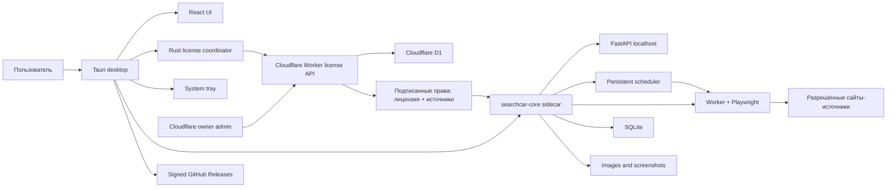

# План реализации SearchCar Desktop

Версия плана: 1.2

Дата: 2 августа 2026 года

Статус: реализация начата; текущий прогресс фиксируется в
`docs/IMPLEMENTATION_STATUS.md`

## 1. Цель

Преобразовать работающий localhost-first web-проект SearchCar в
устанавливаемое локальное приложение для Windows и macOS, которое:

- запускается без Docker, PostgreSQL, Node.js и Python у клиента;
- сохраняет текущий интерфейс и бизнес-логику;
- хранит пользовательские проекты, авто, историю и изображения локально;
- скрывает исходный Python-код наиболее ценной логики;
- поддерживает trial и продлеваемые лицензии, привязанные к одному компьютеру;
- использует бесплатную онлайн-инфраструктуру лицензирования;
- выполняет ручные и фоновые автоматические поиски по расписанию, пока
  приложение работает в окне или системном tray;
- допускает безопасный просмотр и экспорт данных после окончания подписки;
- устанавливается, обновляется, резервируется и переносится по инструкции,
  понятной человеку без технической подготовки;
- развивается независимо от исходного web-репозитория.

## 2. Безопасность исходной версии и структура репозиториев

### 2.1 Уже выполненная изоляция

Новый репозиторий создан как снимок отслеживаемого кода исходного проекта:

```text
2026-07-23/
├── files-mentioned-by-the-user-monitor/   # существующая web-версия
└── searchcar-desktop/                     # новая desktop-ветка продукта
```

В новую копию намеренно не перенесены:

- `.git` исходного проекта;
- `.env` и другие секреты;
- `node_modules` и build caches;
- `.wrangler`, `dist`, `outputs`, `work`;
- пользовательская БД Docker;
- `storage` с изображениями и скриншотами;
- `legacy-data`.

Первый коммит нового репозитория должен оставаться неизменяемой точкой
сравнения с web-версией. Для него создаётся тег `web-baseline-2026-08-02`.

### 2.2 Будущие репозитории

Рекомендуемая структура GitHub:

```text
KaplunSergey/SearchCarDesktop           # private, весь исходный код
KaplunSergey/SearchCarDesktop-Releases  # public, только бинарники/manifest
```

Публичный releases-only репозиторий не содержит product source, CI scripts,
ключи или `.env`. Автоматические source archives GitHub будут содержать только
его пустой release manifest/README, а не приватный код приложения.

### 2.3 Правила Git

- `main` всегда должна проходить тесты и собираться;
- каждая фаза выполняется отдельной feature-веткой;
- перед миграцией БД, лицензированием и выпуском создаются теги;
- изменения схемы имеют миграцию и обратимый data-backup сценарий;
- никакие секреты не коммитятся;
- исходный web-репозиторий не используется как рабочая директория desktop-задач;
- перенос исправлений между репозиториями выполняется осознанным cherry-pick,
  а не синхронизацией каталогов.

## 3. Объём первой версии

### 3.1 Входит в первую версию

- Windows 10/11 x64;
- macOS 13+ Apple Silicon;
- Tauri desktop shell;
- текущий React UI;
- FastAPI, scanner, parser и worker как один скомпилированный sidecar;
- Playwright Chromium внутри поставки;
- SQLite и локальное файловое хранилище;
- ручной поиск проектов и ручное индивидуальное обновление авто;
- scheduler с выбором проектов, периодичности и режима поиска;
- фоновые scans при свёрнутом/скрытом окне;
- system tray, обратный отсчёт до следующего запуска и отмена текущего scan;
- сохранение частичного отчёта, если сон прерывает scan, и один немедленный
  catch-up запуск после сна/перезапуска при просроченном расписании;
- один автоматически создаваемый локальный рабочий профиль после активации;
- центральная запись клиента и управление лицензией только в Cloudflare-админке;
- бесплатный 30-дневный trial;
- ключи 1/3/6/12 месяцев и бессрочный;
- ежедневная проверка лицензии и один день льготы при сбое связи;
- отдельная web-админка лицензий;
- перенос лицензии владельцем;
- backup/restore данных между Windows и macOS;
- подписанные Tauri updates;
- неподписанные/adhoc pilot installers с инструкциями;
- диагностический пакет без секретов;
- инструкции владельца и клиента.

### 3.2 Не входит в первую версию

- Intel Mac;
- Linux;
- Microsoft Store и Mac App Store;
- отдельная системная служба, продолжающая работу после команды `Выйти`;
- выполнение scan, когда компьютер выключен, находится в sleep или не имеет сети;
- merge двух независимых клиентских баз;
- синхронизация автомобильных данных между компьютерами;
- удалённое хранение проектов и изображений;
- парольный клиентский cloud-аккаунт и самостоятельная регистрация клиента;
- гарантированная поддержка виртуальных машин;
- шифрование SQLite, изображений и backup;
- аппаратный USB-ключ;
- абсолютная защита от дизассемблирования;
- платные сертификаты подписи Windows/macOS на этапе пилота.

## 4. Целевая архитектура



### 4.1 Процессы клиента

`SearchCar Desktop` запускает один `searchcar-core` sidecar. Sidecar имеет
подкоманды или внутренние режимы `serve`, `worker`, `migrate`, `backup` и
`diagnose`, но клиент их не запускает вручную.

Предпочтительный runtime:

1. Tauri получает single-instance lock.
2. Определяет каталог данных ОС.
3. Запускает sidecar с одноразовым session secret и случайным localhost-портом.
4. Sidecar применяет SQLite migrations и выполняет health check.
5. FastAPI раздаёт статический frontend и `/api` с одного origin.
6. Tauri открывает окно только после готовности backend.
7. Если scheduler включён, обычное закрытие окна скрывает его в system tray,
   сохраняя sidecar и расписание активными.
8. Команда `Выйти` предупреждает об активном scan, выполняет graceful shutdown,
   закрывает Chromium и помечает незавершённые jobs как `INTERRUPTED`.
9. Перед сном приложение не обещает продолжение работы: уже записанные порции
   результатов остаются в SQLite. При обнаружении сна/пробуждения активный job
   безопасно заканчивается со статусом `INTERRUPTED_SLEEP`, закрывает браузер и
   сохраняет частичный отчёт в истории.

### 4.2 Фоновый lifecycle и scheduler

- scheduler живёт внутри единственного `searchcar-core`, а не в отдельной
  системной службе;
- настройки и `next_run_at` хранятся в SQLite в UTC;
- UI позволяет выбрать проекты, интервал и включение; режим/page depth
  продолжают браться из каждого проекта;
- одновременно выполняется только один scan run, остальные получают `QUEUED`;
- перед запуском проверяются лицензия, сеть, состояние очереди и отсутствие
  выполняющегося обновления приложения;
- между автоматическими запросами применяется небольшой безопасный jitter и
  существующие backoff/retry ограничения, чтобы не создавать одинаковый
  машинный ритм запросов;
- после sleep/wake и после запуска приложения время пересчитывается по
  `last_completed_run_at`: если с последнего полностью завершённого общего
  обновления прошло не меньше выбранного интервала, один catch-up scan ставится
  в очередь сразу, без ожидания нового timer; несколько пропущенных интервалов
  всё равно создают только один run;
- прерванный сном run не сдвигает `last_completed_run_at` и не считается
  полноценным обновлением. Все уже зафиксированные объявления, счётчики и
  проектные статусы остаются в его частичном отчёте;
- глобальный ручной запуск `Обновить проекты` заменяет ближайший автоматический
  запуск: после его завершения scheduler атомарно сохраняет
  `next_run_at = finished_at + текущий интервал`; уже поставленный, но ещё не
  начатый автоматический run объединяется с ручным и отдельно не запускается;
- индивидуальное обновление одного авто и запрос, отклонённый до фактического
  старта, не изменяют `next_run_at`; если интервал изменён во время ручного
  запуска, для нового времени используется последнее сохранённое значение;
- при полном выходе scheduler не работает; если он включён, пользователь видит
  предупреждение и время следующего пропуска;
- завершение, ошибка, captcha и отмена отражаются в истории и, при разрешении,
  системным уведомлением.

### 4.3 Каталоги данных

Windows:

```text
%LOCALAPPDATA%/SearchCar/
├── data/searchcar.sqlite3
├── storage/cars/...
├── logs/...
├── backups/...
└── runtime/...
```

macOS:

```text
~/Library/Application Support/SearchCar/
├── data/searchcar.sqlite3
├── storage/cars/...
├── logs/...
├── backups/...
└── runtime/...
```

В БД хранятся только относительные файловые пути. Каталог установки считается
read-only и не используется для пользовательских данных.

### 4.4 Локальные логи и диагностический отчёт

Приложение ведёт структурированный локальный журнал ключевых действий во всех
своих компонентах: Tauri shell, frontend, FastAPI, worker, scheduler, scanner,
лицензирование, backup/restore и updater. События содержат UTC-время, уровень,
компонент, безопасный код действия, результат и общий correlation ID, чтобы в
отчёте можно было восстановить последовательность одного запуска поиска от
нажатия кнопки до завершения или ошибки.

Логи ротируются и автоматически удаляются: целевой лимит — не более семи дней
и 50 МБ на установку. В них запрещено записывать пароли, cookies, токены,
activation/transfer codes, device/signing keys, контакты, комментарии,
содержимое базы, изображения, полные URL с параметрами и другие пользовательские
данные. Идентификаторы проектов, запусков и устройств в support-отчёте
псевдонимизируются стабильным локальным хешем.

В `Настройки → Диагностика` добавляется кнопка `Создать отчёт для поддержки`.
Пользователь выбирает период (`24 часа` по умолчанию или `7 дней`) и место
сохранения стандартным диалогом Windows/macOS. Приложение создаёт локальный
архив `SearchCar-diagnostics-<date>.zip`, проверяет его и показывает кнопки
`Открыть папку` и `Скопировать код отчёта`. Никакие данные не отправляются
автоматически и облачный сервис для этой функции не требуется.

Архив содержит:

- `manifest.json`: версия приложения и схемы, ОС, время создания, выбранный
  период и случайный support ID;
- очищенные и ограниченные по времени JSONL-логи всех компонентов;
- безопасный health snapshot backend/database/browser/license/updater;
- статусы последних scan/scheduler jobs и их коды завершения без объявлений;
- результаты SQLite integrity/schema checks и список отсутствующих bundled
  runtime-файлов без самой базы и пользовательских файлов.

Перед сохранением UI показывает размер и понятный список содержимого. Создание
отчёта не останавливает активный поиск и читает только закрытые/снимочные файлы.
Архив никогда не включает SQLite, изображения, screenshots, backups, private
keys или production secrets. Автоматическая отправка владельцу может быть
добавлена позже как отдельная opt-in функция; для бесплатного пилота клиент
передаёт сохранённый файл вручную удобным ему способом.

### 4.5 Планируемая структура исходников

```text
apps/
├── desktop-ui/          # Vite React SPA из текущего интерфейса
├── desktop/             # Tauri/Rust shell
└── license-admin/       # отдельная web-админка владельца
backend/                 # FastAPI/parser/scanner/worker
license-service/         # Cloudflare Worker + D1 migrations
packages/
└── license-protocol/    # versioned schemas/test vectors
scripts/                 # setup/build/release/backup helpers
tests/                   # cross-component acceptance tests
docs/                    # owner/client/technical instructions
```

Docker-конфигурация baseline сохраняется для разработки и сравнения до момента,
когда desktop-путь достигнет функционального паритета. Desktop UI собирается как
обычный Vite SPA; Node/Next/Vinext server в установщик не включается.

## 5. Ключевые пользовательские сценарии

### 5.1 Первый запуск и trial

1. Пользователь устанавливает и открывает приложение.
2. Приложение создаёт Ed25519 key pair устройства; private key сохраняется в
   DPAPI на Windows или Keychain на macOS.
3. Создаётся privacy-safe fingerprint из публичного ключа устройства; raw
   hardware identifiers на сервер не отправляются.
4. Первый запуск требует интернет и одноразовый код, выданный владельцем через
   Cloudflare-админку. Пароль клиента не создаётся.
5. Сервер проверяет код, срок, лицензию и отсутствие другой активной привязки,
   затем атомарно связывает лицензию с одним устройством.
6. Бесплатный период, если он выбран владельцем, равен 30 суткам от серверного
   времени; повторное использование кода невозможно.
7. Приложение проверяет подписанный lease, создаёт один локальный рабочий
   профиль без формы логина и сразу открывает рабочую область.
8. Переустановка использует прежний защищённый device key и не создаёт новый
   trial; смена устройства проходит только через подтверждённый перенос.

### 5.2 Ежедневная проверка

- проверка выполняется при старте, если последняя успешная проверка устарела;
- открытое приложение повторяет проверку не реже одного раза в 24 часа;
- сервер возвращает подписанные `server_time`, `license_id`, `device_id`,
  `subscription_expires_at`, `lease_expires_at`, `entitlements`, `app_version`;
- rollback системных часов относительно последнего trusted time вызывает
  немедленную проверку;
- lease допускает один дополнительный день отсутствия связи;
- льгота связи никогда не разрешает поиск после реальной даты окончания;
- истечение lease блокирует операции непосредственно в backend, а не только UI.

### 5.3 Предупреждение и окончание

- за 24 часа и в последний день показывается верхний banner;
- banner содержит точную локальную дату/время и кнопку `Продлить`;
- после окончания доступен экран ввода ключа;
- существующие страницы, фильтры, комментарии, избранное и рейтинг работают;
- разрешены backup, restore, export и открытие сохранённых файлов;
- запрещены project scan, global scan, individual car refresh и постановка
  scheduler jobs; уже ожидающие автоматические jobs получают `SKIPPED_LICENSE`;
- API возвращает единый код `LICENSE_SEARCH_DISABLED`, переводимый UI без
  технического текста.

### 5.4 Продление

1. Владелец создаёт в админке одноразовый ключ, заранее привязанный к лицензии.
2. Пользователь вставляет ключ.
3. Backend передаёт его серверу только через TLS.
4. Сервер атомарно проверяет hash, unused status, target license и срок.
5. Для активной лицензии новый срок считается от текущего окончания; для
   истёкшей — от текущего server time.
6. Server записывает old/new expiry и помечает ключ использованным.
7. Клиент получает новый подписанный lease.

### 5.5 Перенос устройства

Нормальный сценарий:

1. На старом компьютере создаётся проверенный `.searchcar-backup`.
2. На новом компьютере приложение создаёт device key и одноразовый transfer
   request со сроком действия около 30 минут.
3. Пользователь передаёт короткий код владельцу.
4. Владелец открывает лицензию, вводит код и видит сравнение устройств.
5. После второго подтверждения D1-транзакция деактивирует старую привязку,
   создаёт новую, сохраняет срок и увеличивает activation count.
6. Новый компьютер получает lease; старый перестаёт получать новые lease.
7. Пользователь восстанавливает `.searchcar-backup`.

Если старое устройство потеряно, шаг backup возможен только из ранее созданной
копии, но администратор всё равно может перепривязать лицензию. Перенос не
использует и не восстанавливает старый subscription key.

Из-за ежедневной модели старый компьютер может работать до окончания последнего
lease, максимум около 48 часов. Мгновенное отключение потребовало бы онлайн-
проверки перед каждым поиском и не входит в текущие решения.

### 5.6 Автоматический поиск по расписанию

1. Пользователь открывает `Настройки → Планировщик`.
2. Включает scheduler, выбирает периодичность и проекты.
3. Для каждого проекта сохраняются его точный/быстрый режим и первая/все
   страницы; scheduler не подменяет эти настройки.
4. Экран показывает точное время следующего запуска и обратный отсчёт.
5. В момент запуска все выбранные проекты получают `Ожидает`, текущий —
   `Обновление`, завершённый — `Обновлено` независимо от остальных.
6. Запуски выполняются последовательно через общую очередь. Повторный timer не
   создаёт дубликат, пока предыдущий run выполняется.
7. Отчёт и история создаются так же, как при ручном запуске; доступна отмена.
8. Закрытие окна оставляет приложение в tray. Из tray можно открыть окно,
   временно приостановить scheduler или полностью выйти.
9. Если компьютер спал или был выключен, при пробуждении/следующем запуске
   приложение сравнивает время последнего полного обновления с интервалом.
   При просрочке оно немедленно ставит один catch-up run, а не начинает отсчёт
   нового интервала. Несколько пропусков не создают очередь из нескольких run.
   Scan, прерванный сном, остаётся в истории как частичный.
10. Перед автоматическим run backend проверяет действующую лицензию. При
    истечении срока поиск не начинается, а пользователь получает уведомление.
11. Ошибка сети/captcha использует ограниченный retry/backoff и не запускает
    бесконечный цикл.
12. Если пользователь нажимает глобальную кнопку `Обновить проекты`, активный
    countdown приостанавливается, а ещё не начатый автоматический run для тех же
    проектов поглощается ручным запуском, чтобы проекты не обновлялись дважды.
13. Когда фактически начавшийся ручной run переходит в терминальное состояние
    (`COMPLETED`, `PARTIAL`, `FAILED` или `CANCELLED`), scheduler вычисляет
    `next_run_at` от времени его завершения и текущего сохранённого интервала.
    Например, завершение в 10:27 даёт следующий запуск в 11:27 при интервале
    один час и в 13:27 при интервале три часа.
14. Если scheduler выключен, ручной запуск не создаёт расписание. Обновление
    одной машины также не сдвигает автоматическое обновление проектов. Если
    ручной запрос не был принят или не дошёл до старта, прежнее время остаётся.

Пересчёт `next_run_at` и завершение ручного run выполняются в одной транзакции.
Timer перед постановкой job повторно сверяет сохранённое время, поэтому гонка
между нажатием кнопки и срабатыванием таймера не создаёт второй scan.

Приложение запускается пользователем вручную. Автозапуск вместе с ОС исключён
из первой версии отдельным продуктовым решением.

## 6. Локальная база и перенос существующих данных

### 6.1 SQLite baseline

Текущие PostgreSQL migrations нельзя запускать на SQLite из-за JSONB, casts,
`UPDATE ... FROM`, lateral queries и DDL constraints. Поэтому создаётся новая
baseline migration, соответствующая актуальной схеме web-версии.

Обязательные настройки SQLite:

- `PRAGMA foreign_keys=ON`;
- WAL mode;
- `busy_timeout`;
- UTC timestamps через единый TypeDecorator или epoch;
- один backend и один scanner;
- короткие write transactions;
- сетевой Playwright I/O вне открытой write transaction;
- атомарный захват queued job без PostgreSQL `SKIP LOCKED`;
- single-instance lock на уровне Tauri.

### 6.2 Конвертер PostgreSQL → SQLite

Отдельный migration wizard:

1. не изменяет исходную PostgreSQL-базу;
2. просит выбрать папку старого проекта либо автоматически обнаруживает её;
3. проверяет доступность Docker/PostgreSQL;
4. читает данные в согласованном snapshot;
5. сохраняет IDs, JSON и связи;
6. нормализует даты в UTC;
7. превращает абсолютные пути файлов в относительные;
8. копирует storage с checksums;
9. сравнивает количество строк по таблицам;
10. выполняет `foreign_key_check` и `integrity_check`;
11. показывает отчёт до переключения приложения на новую базу.

Если автоматическое обнаружение невозможно, инструкция старта старой Docker-
версии должна быть пошаговой. Конвертер остаётся в новом репозитории и не требует
изменения исходного проекта.

### 6.3 Формат backup

```text
backup.searchcar-backup
├── manifest.json
├── database.sqlite3
├── storage/cars/...
└── checksums.json
```

Export блокирует новый поиск, ждёт окончания или отмены активного, использует
SQLite Online Backup API и проверяет архив. Restore распаковывает во временный
каталог, проверяет schema/checksums, обновляет копию до текущей схемы, создаёт
rollback-backup и только затем атомарно заменяет данные.

Незавершённые jobs становятся `INTERRUPTED`, auth sessions сбрасываются. License
state, device private key и lease никогда не входят в архив.

## 7. Защита кода и локального API

### 7.1 Что защищаем

- `parser.py`;
- `scanner.py`;
- integrity/change-detection algorithms;
- `services.py` с ценной бизнес-логикой;
- `worker.py`;
- FastAPI backend;
- license enforcement.

### 7.2 Механизмы

- Nuitka standalone/onefile prototype, затем выбор наиболее стабильного режима;
- strip debug symbols там, где это не мешает crash diagnostics;
- release frontend без source maps и DevTools;
- лицензирование в Rust/Tauri и повторная проверка в sidecar;
- localhost API на случайном порту;
- одноразовый session secret между Tauri и sidecar;
- CORS/origin allowlist и secure local cookies;
- backend не слушает внешний сетевой интерфейс;
- server signing private key отсутствует в клиенте;
- клиент содержит только verification public key;
- Tauri update private key хранится только у владельца/CI.

Cython рассматривается только после измерения результата Nuitka и не является
обязательной зависимостью первой версии.

## 8. Лицензионный сервис и админка

### 8.1 Бесплатная инфраструктура

- Cloudflare Worker: API;
- Cloudflare D1: transactional state;
- Cloudflare Pages или Worker static assets: admin UI;
- Worker Secrets: signing key, admin secrets, peppers;
- `workers.dev`/`pages.dev`: бесплатные адреса;
- регулярный D1 export и offline backup ключей.

Система проектируется так, чтобы endpoint и данные можно было перенести на
другого провайдера через конфигурацию/обновление клиента.

### 8.2 Минимальная схема D1

- `customers` — владелец лицензии и минимальный контакт;
- `licenses` — type, status, trial, expiry, perpetual;
- `source_catalog` — неизменяемый ключ, название и доступность каждого сайта-источника;
- `license_sources` — какие ключи источников разрешены данной лицензии;
- `devices` — public key, fingerprint hash, active state, first/last seen;
- `activation_codes` — hash, duration, target license, used state;
- `license_checks` — агрегированная последняя проверка и версия;
- `renewals` — old/new expiry, code id, actor, timestamp;
- `device_transfers` — old/new device, request, actor, result;
- `admin_users` и `admin_sessions`;
- `audit_events` — security-sensitive owner actions;
- `app_releases` — latest/minimum version metadata.

Сырые hardware identifiers, клиентская автомобильная база, изображения,
пароли и комментарии на лицензирующий сервер не отправляются.

### 8.3 API

Версионированные endpoints:

- `POST /v1/trials/activate`;
- `POST /v1/licenses/check`;
- `POST /v1/licenses/redeem`;
- `POST /v1/transfers/request`;
- `POST /v1/transfers/claim`;
- `GET /v1/releases/latest`;
- admin CRUD для customers/licenses/codes/transfers/backups.

Обязательны schema validation, idempotency keys, rate limits, replay protection,
atomic redemption, signed responses, structured audit и безопасные ошибки без
разглашения существования пользователей/ключей.

### 8.4 Админка

Операции выполняются кнопками:

- создать карточку клиента;
- открыть 30-дневный trial;
- создать лицензию;
- создать ключ 1/3/6/12 месяцев или perpetual;
- предварительно показать новую дату;
- просмотреть использованные/неиспользованные ключи;
- подтвердить перенос устройства;
- просмотреть version, activation count, check time и renewal history;
- включить или отключить каждый доступный сайт-источник для конкретной лицензии;
- выгрузить audit и backup.

Регистрация клиентов публично не показывается. Админка имеет отдельную strong
authentication, rate limiting, короткие sessions и recovery codes. Конкретный
механизм выбирается после spike на Worker runtime; он не должен требовать
платного Cloudflare Access.

### 8.5 Центральная модель клиента без клиентского пароля

Для первого коммерческого запуска не создаётся облачный парольный аккаунт
клиента. В Cloudflare хранится только карточка клиента с контактом, лицензией,
привязанным устройством и включёнными источниками. Это уменьшает сложность и
не добавляет риск восстановления клиентских паролей.

Первый запуск на устройстве выглядит так:

1. владелец создаёт карточку клиента, лицензию и одноразовый код в центральной
   админке;
2. клиент вводит код в приложении;
3. приложение создаёт ключ устройства, получает подписанный lease и создаёт
   единственный локальный рабочий профиль автоматически;
4. последующие запуски не требуют логин или пароль: доступ доказывает ключ
   устройства, а данные защищаются учётной записью операционной системы;
5. смена компьютера выполняется через перенос, одобренный владельцем.

В первый релиз один клиент равен одной лицензии и одному активному устройству.
Локальные проекты, автомобили, изображения и пользователи не синхронизируются
и на Cloudflare не отправляются. На общем компьютере позднее можно добавить
локальный PIN, но он не является облачной учётной записью и не нужен для
лицензирования.

Каждый сайт-парсер получает постоянный ключ, например `encar`. Владелец
включает такие ключи для лицензии в админке. Worker помещает разрешённый набор
в подписанный lease, UI показывает его, а desktop backend запрещает запуск scan
по источнику, которого в lease нет. Поэтому новый сайт можно добавить в обновлении клиента,
а доступ открывать по клиентам постепенно и отзывать централизованно — без
облачной синхронизации их данных. Админка не загружает и не исполняет парсер:
сам парсер появляется только в проверенном обновлении приложения; админка
управляет исключительно правом его использовать.

## 9. Обновления и релизы

### 9.1 Update model

Используется Tauri Updater и отдельный публичный releases-only репозиторий. В
нём находятся только установочные artifacts, подписи, release notes и
`latest.json`; source repo остаётся private.

Текущая версия имеет один источник истины и синхронизируется CI между Tauri,
Rust и frontend build metadata. Она отображается:

- компактно в нижней части sidebar, например `v1.2.0`;
- полностью в `Настройки → О приложении`;
- в диагностическом пакете;
- в лицензионной админке как версия последней проверки устройства.

Проверка выполняется:

- после успешного запуска приложения;
- затем не чаще одного раза в 6 часов, пока приложение работает;
- вручную по кнопке `Проверить обновления`;
- независимо от состояния подписки, чтобы истёкший клиент тоже мог обновиться.

Tauri/Rust, а не frontend JavaScript, загружает по HTTPS `latest.json` из
последнего стабильного GitHub Release и сравнивает SemVer. Draft/prerelease не
показываются пользователям stable-канала.

Пример updater manifest:

```json
{
  "version": "1.3.0",
  "notes": "Исправления поиска и новая история обновлений",
  "pub_date": "2026-08-20T12:00:00Z",
  "platforms": {
    "windows-x86_64": {
      "url": "https://github.com/.../SearchCar_1.3.0_x64-setup.nsis.zip",
      "signature": "BASE64_ED25519_SIGNATURE"
    },
    "darwin-aarch64": {
      "url": "https://github.com/.../SearchCar.app.tar.gz",
      "signature": "BASE64_ED25519_SIGNATURE"
    }
  }
}
```

Если `latest.version > current.version`, интерфейс показывает заметную, но не
блокирующую кнопку `Обновить до v1.3.0` и краткие release notes. Если версия
актуальна, отображается `Установлена последняя версия`.

После нажатия `Обновить`:

1. UI проверяет активный scan. Пользователь может дождаться завершения либо
   явно отменить его; scheduler временно ставится на паузу.
2. Создаётся автоматический pre-update backup SQLite и manifest текущей версии.
3. Tauri скачивает artifact и показывает прогресс `0–100%`.
4. Встроенный публичный updater key проверяет обязательную Ed25519-подпись.
   Несовпадение подписи полностью отменяет установку.
5. После проверки приложение останавливает sidecar и Chromium.
6. Tauri устанавливает платформенный update и перезапускает приложение.
7. Новый sidecar проверяет backup, применяет SQLite migrations и запускает
   health checks до открытия основного окна.
8. При успехе pre-update backup сохраняется ограниченное время, scheduler
   возобновляется и показывается `Обновлено до v1.3.0`.

Состояния кнопки: `Проверка`, `Доступно`, `Загрузка N%`, `Проверка подписи`,
`Установка`, `Перезапуск`, `Ошибка — повторить`. Ошибка сети или GitHub не
мешает работе текущей версии. Ошибка до установки оставляет текущую версию без
изменений. При ошибке migration данные восстанавливаются из pre-update backup,
а пользователю предлагается диагностический пакет и сохранённый предыдущий
installer. Автоматический downgrade БД не выполняется.

Update signing key не является сертификатом Windows/macOS и не требует платной
подписки. Private updater key хранится только в GitHub Secrets/offline backup;
в приложение встраивается только public key.

### 9.2 CI без платной подписки

GitHub Actions workflow собирает matrix:

- `windows-latest`, target x86_64, NSIS `.exe`;
- `macos` Apple Silicon runner или проверенная local/CI arm64 сборка, `.dmg`;
- unit/integration tests;
- Nuitka sidecar;
- закреплённый Playwright browser;
- Tauri package;
- checksums/SBOM;
- update signatures;
- draft release для ручного smoke test;
- публикация только после approval.

Если бесплатные CI minutes или arm64 runner недоступны, остаются документированные
локальные one-command builds. Ни один секрет не записывается в workflow logs.

### 9.3 Неподписанный пилот

Windows pilot может показывать SmartScreen; macOS build получает ad-hoc подпись
и требует `Open Anyway`. Это допустимо только для информированного пилота.

Платный production-signing — отдельный gate перед коммерческой поставкой:

- Apple Developer ID + notarization;
- доверенный Windows code-signing certificate;
- подпись installer, sidecar и вложенных browser helpers.

## 10. Поэтапная реализация

Оценки ниже — ориентиры для одного разработчика, а не обещание календарной даты.
Каждая фаза завершается демонстрацией и отдельным коммитом/тегом.

### Фаза 0. Изоляция и baseline — выполнено частично

Задачи:

- создать соседний репозиторий из Git-снимка;
- исключить secrets/runtime data/caches;
- зафиксировать baseline commit и tag;
- добавить plan/decisions/operations docs;
- проверить, что исходный репозиторий чист и не изменён;
- настроить новый private remote позднее отдельным действием.

Критерий готовности: обе папки имеют независимые `.git`; baseline нового repo
совпадает по tracked content с исходным commit; текущий сайт запускается как
раньше.

### Фаза 1. Test baseline, feasibility spike и desktop skeleton — 2–4 дня

Задачи:

- зафиксировать текущие backend/frontend тесты;
- добавить desktop-specific configuration без удаления Docker development;
- создать Tauri 2 skeleton;
- создать минимальный Vite SPA build текущего UI;
- запустить минимальный Nuitka sidecar на обеих целевых платформах;
- bundled Playwright должен открыть тестовую страницу и сохранить screenshot;
- runtime API URL заменить на same-origin `/api`;
- реализовать single-instance и lifecycle prototype;
- добавить platform data directories и structured logging.

Критерий: dev desktop window открывает существующий UI, health check проходит,
закрытие не оставляет процессов, а минимальный compiled scanner работает без
системных Python/Node/Docker. Если Playwright packaging не проходит, дальнейший
рефакторинг приостанавливается до смены packaging approach.

### Фаза 2. SQLite и очередь — 5–8 дней

Задачи:

- новая SQLite baseline schema;
- UTC timestamp type;
- FK/WAL/busy timeout;
- заменить `FOR UPDATE`/`SKIP LOCKED`;
- сократить транзакции вокруг Playwright;
- восстановление interrupted jobs;
- перенос существующих scheduler settings и scheduled-project relations;
- атомарное вычисление/сохранение `next_run_at`;
- тесты concurrency, constraints, cascade и timezone;
- seed/onboarding без CLI.

Критерий: весь backend test suite проходит на SQLite; два процесса не могут
одновременно захватить job; crash не оставляет вечный `RUNNING`.

### Фаза 3. Конвертер и backup foundation — 4–7 дней

Задачи:

- read-only PostgreSQL → SQLite converter;
- относительные storage paths;
- counts/integrity/file validation;
- `.searchcar-backup` export/restore library;
- rollback backup;
- cross-platform path tests;
- UI wizard для миграции текущей локальной установки.

Критерий: копия реальной базы мигрируется без изменения источника; counts и
checksums совпадают; backup восстанавливается в чистой установке.

### Фаза 4. Sidecar и Playwright packaging — 5–8 дней

Задачи:

- единый `searchcar-core` entrypoint;
- Nuitka build matrix;
- включить совместимый Chromium/headless shell;
- направить browser paths на bundled resources;
- graceful cancellation/shutdown;
- внешний Encar открывать системным браузером;
- smoke scans в установочной структуре;
- оценить размер и время установки.

Критерий: машина без Python/Node/Docker запускает backend и выполняет полный
ручной поиск с изображениями и скриншотом; sidecar продолжает работу при
скрытом окне.

### Фаза 5. Scheduler, tray и фоновые scans — 4–6 дней

Задачи:

- адаптировать существующий scheduler к единственному desktop sidecar;
- экран enabled/interval/projects с понятным временем последнего полного и
  следующего автоматического обновления;
- system tray: открыть, пауза, следующий запуск, выйти;
- закрытие окна в tray при включённом scheduler;
- suspend/resume detection: завершение активного scan как `INTERRUPTED_SLEEP`
  с уже сохранёнными результатами и закрытием Chromium;
- немедленный один catch-up run после wake/следующего запуска, если
  `last_completed_run_at + interval <= now`, без ожидания нового timer;
- единая очередь без overlapping scans и duplicate timers;
- атомарный re-anchor scheduler после глобального ручного `Обновить проекты`;
- объединение ожидающего automatic run с ручным и защита от timer/manual race;
- countdown и актуальные project statuses;
- cancel/pause/resume;
- license/network/captcha guards;
- bounded retry, backoff и безопасный jitter;
- системные уведомления и полная история автоматических запусков;
- тесты сна, смены timezone/DST, перезапуска и долгого scan.

Критерий: выбранные проекты обновляются в фоне при скрытом окне, пропущенный
интервал не создаёт дубликаты, полное `Выйти` останавливает процессы. Если сон
прервал scan, история показывает частичный отчёт с понятной причиной, а после
пробуждения/следующего запуска просроченное расписание запускает не более одного
catch-up run сразу, без ожидания нового timer. Если ручное
обновление проектов завершилось в 10:27, следующий автоматический запуск
отображается как 11:27 для часового интервала или 13:27 для трёхчасового; второй
run от старого timer не появляется.

### Фаза 6. Cloudflare license service — 4–7 дней

Задачи:

- Worker project и D1 migrations;
- trial/check/redeem/transfer APIs;
- server time и signed leases;
- hash-only one-time codes;
- idempotency/replay/rate limits;
- audit events;
- backup/export scripts;
- local Miniflare/Worker tests;
- бесплатный deploy workflow.

Критерий: duplicate code redemption невозможен; clock comes only from server;
перенос атомарен; API восстанавливается из documented backup.

### Фаза 7. Клиентское enforcement — 4–6 дней

Задачи:

- device key в DPAPI/Keychain;
- fingerprint strategy и privacy review;
- Rust lease verification;
- trusted time state;
- backend entitlement guard;
- entitlement guard перед каждым scheduler enqueue/start;
- banner/expiry/redeem UI;
- read-only safe mode;
- perpetual flow;
- network grace;
- tests clock rollback, expired, offline и copied DB.

Критерий: UI/API обход не запускает scanner без entitlement; перевод времени и
копирование backup не продлевают доступ; просмотр данных после expiry работает.

### Фаза 8. Лицензионная админка — 4–6 дней

Задачи:

- secure owner login;
- customers/licenses/devices screens;
- key generation;
- renewal history;
- device transfer confirmation;
- activation count/version/check time;
- audit/export;
- русские понятные ошибки и подтверждения;
- responsive UI и owner runbook.

Критерий: нетехнический владелец самостоятельно создаёт trial, выдаёт ключ,
проверяет срок и переносит устройство без терминала.

### Фаза 8.5. Единая Cloudflare-админка, клиент без пароля и права источников — 7–10 дней

Статус: реализуется. Уже готовы локальные first-run без клиентского пароля,
signed allow-list источников, Encar по умолчанию, owner-переключатели и
backend/worker-проверка. До завершения фазы остаются удалённая D1 migration,
deploy, installer-проверки на macOS/Windows и миграционный сценарий для
существующих pilot-установок.

Задачи:

- заменить создание локального пользователя в production first-run на ввод
  одноразового invite/activation code и автоматическое создание одного
  локального рабочего профиля;
- не показывать клиенту локальную форму создания пользователей и не выдавать
  ей полномочия управления лицензиями;
- расширить центральную карточку клиента: контакт, лицензия, устройство,
  история, статус и безопасный перенос;
- добавить каталог источников (`encar`, последующие сайты) и права
  `license → source`;
- выдать `encar` по умолчанию существующим активным pilot-лицензиям при
  миграции, чтобы обновление не остановило их текущий поиск;
- включать набор разрешённых источников в подписанный lease, проверять
  подлинность lease в Rust-координаторе и проверять конкретный источник в
  backend до запуска scan; UI должен показывать полученный набор;
- добавить в owner UI просмотр и переключатели источников по лицензии,
  аудит выдачи/отзыва и понятный статус устройства;
- мигрировать существующие pilot-локальные учётные записи без потери данных;
- покрыть тестами first-run, повторную установку, перенос, включение/отзыв
  источника и недопустимый обход локального UI/API.

Критерий: владелец полностью создаёт клиента, выдаёт доступ и управляет
источниками в одной Cloudflare-админке; клиент не создаёт пароль и не видит
источники, которые не включены его лицензии; данные сканирования остаются
только на его компьютере.

### Фаза 9. Полный backup и перенос устройства — 3–5 дней

Задачи:

- UI create/download/import/restore with validation before acceptance;
- transfer request UI;
- admin approval flow;
- restore на новой OS;
- автоматическое отключение старой binding;
- event/history/activation count;
- broken-old-device flow;
- support copy text.

Критерий: полный сценарий Mac → Windows и Windows → Mac проходит по инструкции;
license state не копируется; old device не получает новый lease.

### Фаза 10. Updater, версия и release automation — 5–8 дней

Задачи:

- release-only repo;
- Tauri signing keys и offline recovery copy;
- GitHub Actions matrix;
- единый источник версии и синхронизация Tauri/Rust/UI;
- отображение версии в sidebar/settings/diagnostics/admin;
- генерация и публикация signed `latest.json`;
- SemVer check при старте, каждые 6 часов и вручную;
- кнопка `Обновить до vX.Y.Z`, release notes и progress states;
- координация update с активным scan и scheduler pause;
- pre-update database backup;
- download, Ed25519 verification, install, restart и migrations;
- retry/manual-download fallback;
- rollback procedure;
- release notes и one-click owner workflow.

Критерий: старая пилотная сборка видит новую, проверяет подпись, обновляется и
сохраняет данные; изменённый artifact отклоняется; недоступный GitHub не мешает
текущей версии; scheduler не стартует во время update.

### Фаза 11. Installers и nontechnical documentation — 4–7 дней

Задачи:

- NSIS `.exe`;
- ad-hoc signed `.dmg`;
- uninstall без удаления данных по умолчанию;
- optional `Удалить и данные` с двойным подтверждением;
- Windows/macOS installation screenshots;
- first-run/backup/license/transfer/release/disaster instructions;
- структурированные rotating logs для shell/frontend/backend/worker/scanner,
  scheduler/license/backup/updater с единым correlation ID;
- экран `Настройки → Диагностика`, выбор периода и кнопка `Создать отчёт для
  поддержки` с системным выбором папки;
- очищенный проверяемый diagnostic ZIP, preview состава, support ID, кнопки
  `Открыть папку` и `Скопировать код отчёта`;
- тесты redaction, размера/retention, повреждённого log-файла и создания отчёта
  во время активного scan;
- независимый usability walkthrough.

Критерий: тестовый пользователь без навыков разработки проходит installation,
trial, scan, backup, renewal и transfer только по документации; при намеренно
вызванной ошибке он одной кнопкой сохраняет диагностический архив, в котором
видна последовательность действий, но отсутствуют секреты и рабочие данные.

### Фаза 12. Security, reliability и pilot — 6–12 дней

Задачи:

- threat-model review;
- dependency/license/SBOM review;
- parser regression against known fixtures;
- long scan cancellation and crash recovery;
- scheduler/tray/sleep/wake/DST simulations;
- network/captcha/server outage simulations;
- D1 backup restore drill;
- corrupted backup/update tests;
- Windows 10/11 and macOS 13+ matrix;
- 1–3 pilot devices;
- проверка диагностических архивов с реальных pilot devices и исправления по
  telemetry-free support logs;
- негативный тест, подтверждающий отсутствие паролей, кодов активации, device
  keys, базы, изображений и комментариев в готовом архиве.

Критерий: все acceptance scenarios ниже пройдены, critical defects отсутствуют,
rollback и disaster recovery проверены практикой.

### Фаза 13. Коммерческая подпись — отложена

После успешного бесплатного пилота:

- Apple Developer Program, Developer ID и notarization;
- Windows certificate/Trusted Signing;
- подпись всех nested binaries;
- повторная проверка SmartScreen/Gatekeeper;
- обновление пользовательских инструкций.

### Фаза 14. Облачная синхронизация рабочих данных — сознательно отложена

Не является условием первого запуска и не входит в ближайшие фазы. Если она
понадобится позднее, это будет отдельный продуктовый этап с центральным
хранилищем проектов/автомобилей/изображений, политикой конфликтов, правами
доступа, резервным копированием и оценкой стоимости. Управление лицензиями и
доступом к источникам из фазы 8.5 работает без неё.

## 11. Acceptance matrix

### Установка и lifecycle

- чистая Windows 10 x64;
- чистая Windows 11 x64;
- macOS 13+ Apple Silicon;
- первый запуск без Docker/Node/Python;
- второй экземпляр не запускается;
- закрытие окна при scheduler скрывает приложение в tray;
- команда `Выйти` полностью останавливает sidecar;
- закрытие во время scan не повреждает БД;
- restart восстанавливает понятный статус.

### Scheduler и фоновые scans

- можно выбрать периодичность и набор проектов;
- countdown совпадает с сохранённым `next_run_at`;
- окно можно закрыть, scan продолжается в tray;
- два timer events не создают overlapping runs;
- глобальное ручное `Обновить проекты` после завершения переносит
  `next_run_at` на полный текущий интервал вперёд;
- ожидающий автоматический run объединяется с ручным и не выполняется следом;
- индивидуальное обновление авто и отклонённый до старта ручной запрос не
  сдвигают расписание;
- изменение интервала во время ручного run применяется при вычислении нового
  `next_run_at`;
- сон во время scan завершает job как `INTERRUPTED_SLEEP`; уже добавленные
  объявления и прогресс доступны в частичном отчёте истории;
- если после wake/следующего запуска `last_completed_run_at + interval <= now`,
  сразу выполняется максимум один catch-up run; новый countdown до него не
  запускается;
- после полного выхода scan не выполняется и UI предупреждает об этом;
- expired license не позволяет scheduler поставить/запустить job;
- update ставит scheduler на паузу;
- отменённый автоматический run корректно отражается в истории.

### Данные

- PostgreSQL converter сохраняет counts/relationships;
- изображения доступны после миграции;
- backup создаётся при активной и истёкшей лицензии;
- restore не переносит лицензию;
- restore более старой schema выполняет migration;
- испорченный архив не заменяет рабочие данные;
- Windows/macOS cross-restore.

### Лицензия

- trial только один раз на пользователя/устройство;
- reinstall не создаёт новый trial;
- часы назад/вперёд не продлевают срок;
- code redeem строго один раз;
- 1/3/6/12 месяцев корректно прибавляются;
- perpetual не истекает, но проверяет device binding;
- один день outage grace;
- реальный expiry сразу блокирует search;
- scheduler не обходит expiry и entitlement checks;
- local data остаются доступны;
- copied DB не активирует другой компьютер;
- transfer сохраняет срок и отключает old binding;
- concurrent transfer/redeem atomic.

### Обновление

- корректно подписанное обновление устанавливается;
- изменённое/неподписанное отклоняется;
- данные сохраняются;
- current version видна в sidebar, settings, diagnostics и admin UI;
- при отсутствии новой версии кнопка обновления не показывается;
- при более новой stable-версии появляется `Обновить до vX.Y.Z`;
- progress и ошибки понятны без терминала;
- active scan требует дождаться или подтвердить отмену;
- failed download/verification оставляет текущую версию;
- migration failure восстанавливает pre-update data backup.

### UX без технических навыков

- клиент не открывает терминал;
- владелец использует admin UI/Run workflow;
- каждая ошибка содержит действие, а не stack trace;
- support package создаётся одной кнопкой;
- все опасные действия имеют preview и confirmation;
- независимый тестировщик проходит ключевые сценарии по инструкции.

## 12. Основные риски и меры

| Риск | Влияние | Снижение риска |
| --- | --- | --- |
| Playwright/Chromium не собирается с Nuitka | Высокое | Отдельный packaging spike до лицензирования, pinned versions, platform CI |
| SQLite lock во время долгого scan | Высокое | Короткие транзакции, один worker, WAL, busy timeout, stress tests |
| PostgreSQL migration теряет связи/файлы | Высокое | Read-only source, counts, FK/integrity checks, rollback report |
| Закрытие приложения оставляет job RUNNING | Высокое | Graceful shutdown + startup reconciliation + cancellation tests |
| Пользователь закрыл окно и ожидает scheduler | Высокое | Tray lifecycle, индикатор фоновой работы и отдельная команда `Выйти` |
| Сон/смена времени создаёт серию дубликатов | Высокое | UTC next-run, monotonic guards, один catch-up, idempotency tests |
| Cloudflare free terms меняются | Среднее | Малый portable API, D1 exports, endpoint configuration, provider migration doc |
| License server недоступен | Среднее | Подписанный outage lease, status page, backup/redeploy runbook |
| Потерян signing key | Критическое | Две offline-копии, owner checklist, recovery drill |
| Fingerprint меняется после ремонта/OS reinstall | Среднее | Admin-assisted transfer вместо автоматической блокировки |
| Unsigned installer пугает/блокируется | Высокое для продаж | Pilot instructions; production signing gate |
| Клиент дизассемблирует binary | Остаточное | Nuitka/Rust/no sources; честная граница защиты; server authority |
| Encar captcha/rate limits | Высокое | Conservative scan behavior, wait/readiness checks, clear human-action status |
| CI free quota заканчивается | Среднее | Local one-command Windows/Mac builds |

## 13. Распределение ответственности

### Что можно полностью реализовать и автоматизировать в репозитории

- Tauri shell и lifecycle;
- SQLite schema, converter, backup и restore;
- Nuitka/Playwright packaging;
- Worker API, D1 migrations и admin UI;
- license protocol и client enforcement;
- GitHub Actions и локальные build scripts;
- installer configuration;
- updater и подпись Tauri artifacts;
- тесты, fixtures, diagnostics и recovery scripts;
- все инструкции, checklists и шаблоны сообщений клиенту.

### Что неизбежно должен сделать владелец внешнего аккаунта

- создать или подтвердить Cloudflare/GitHub account;
- войти в Cloudflare через открытое окно браузера и разрешить deployment;
- сохранить offline-копии signing/recovery keys в предложенное безопасное место;
- нажать подтверждение перед публикацией релиза;
- проверить установщик на физическом Windows/Mac;
- выбрать клиента, срок лицензии и подтвердить перенос устройства;
- при будущем платном этапе зарегистрировать Apple Developer/Windows signing
  account и принять юридические условия провайдера.

Для каждого такого действия проект обязан предоставить wizard, кнопку GitHub
Actions или инструкцию со скриншотами. Клиентские операции не должны требовать
терминала. Первоначальная операция владельца допускает максимум одну заранее
подготовленную команду, которая сама проверяет результат и объясняет ошибку.

### Что не передаётся исполнителю и не публикуется

- пароли аккаунтов владельца;
- Cloudflare/GitHub long-lived tokens;
- private license/update signing keys;
- клиентские базы и изображения без явного диагностического запроса;
- production `.env`/`.dev.vars`.

## 14. Контроль стоимости

Первая версия не требует платных подписок:

- Cloudflare Workers/D1/Pages — free tier;
- GitHub private source — существующий аккаунт/доступный free plan;
- GitHub Releases — отдельный binary repository;
- Tauri/Rust/SQLite/Nuitka Community/Playwright — open source;
- ad-hoc macOS и unsigned Windows pilot — бесплатно.

Возможные будущие расходы, не входящие в бесплатный пилот:

- Apple Developer Program;
- Windows code-signing certificate;
- собственный домен;
- платный CI при превышении free minutes;
- платный Cloudflare plan при росте нагрузки.

Любой переход на платный компонент выполняется только после отдельного решения.

## 15. Definition of Done первой версии

Первая desktop-версия готова, когда:

1. исходный web-репозиторий остаётся рабочим и неизменённым;
2. `.exe` и `.dmg` устанавливают самодостаточное приложение;
3. ручной и scheduled scan сайта Encar воспроизводят текущую функциональность;
4. PostgreSQL-данные переносятся в SQLite с проверяемым отчётом;
5. trial, renewal, expiry, perpetual и transfer проходят acceptance tests;
6. после expiry блокируется только поиск/обновление;
7. `.searchcar-backup` переносит данные между поддерживаемыми ОС;
8. версия видна в приложении, новая stable-версия создаёт кнопку обновления, а
   скачанный update проверяется криптографической подписью;
9. владелец управляет лицензиями через отдельную админку;
10. установка и регулярные операции документированы для нетехнического человека;
11. D1 и ключи восстановлены в тестовом disaster drill;
12. scheduler стабильно работает в tray и после sleep;
13. глобальное ручное обновление проектов переносит следующий automatic run на
    полный выбранный интервал без дублирующего запуска по старому timer;
14. пилот успешно отработал минимум на Windows 10, Windows 11 и Apple Silicon Mac.

## 16. Первый следующий шаг после утверждения

Не начинать сразу с лицензирования. Сначала выполнить короткий технический spike:

1. Tauri открывает текущий UI;
2. SQLite baseline поднимает актуальную схему;
3. Nuitka sidecar запускает FastAPI;
4. bundled Playwright открывает одну тестовую страницу Encar;
5. установочная структура проверяется на Windows x64 и macOS arm64.

Этот spike проверяет три наиболее дорогих риска до строительства админки и
лицензионного сервера. После успешного результата план продолжается с Фазы 2;
при проблеме меняется packaging approach без потери текущего приложения.

## 17. Официальные технические ориентиры

- [Tauri sidecars](https://v2.tauri.app/develop/sidecar/)
- [Tauri updater](https://v2.tauri.app/plugin/updater/)
- [Tauri Windows signing](https://v2.tauri.app/distribute/sign/windows/)
- [Tauri macOS signing](https://v2.tauri.app/distribute/sign/macos/)
- [Playwright Python packaging](https://playwright.dev/python/docs/library#pyinstaller)
- [Cloudflare Workers limits](https://developers.cloudflare.com/workers/platform/limits/)
- [Cloudflare D1 pricing](https://developers.cloudflare.com/d1/platform/pricing/)
- [Apple: open an app from an unknown developer](https://support.apple.com/guide/mac-help/open-a-mac-app-from-an-unknown-developer-mh40616/mac)
- [Microsoft Smart App Control](https://learn.microsoft.com/en-us/windows/apps/develop/smart-app-control/overview)
